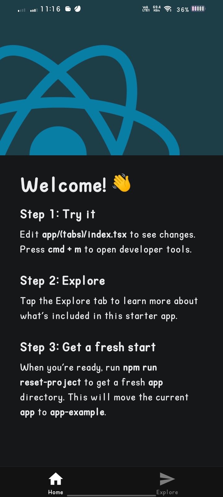
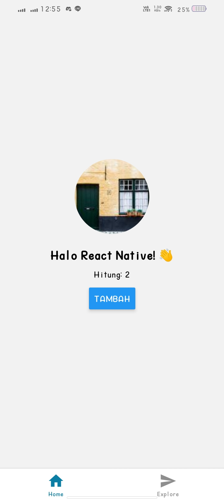
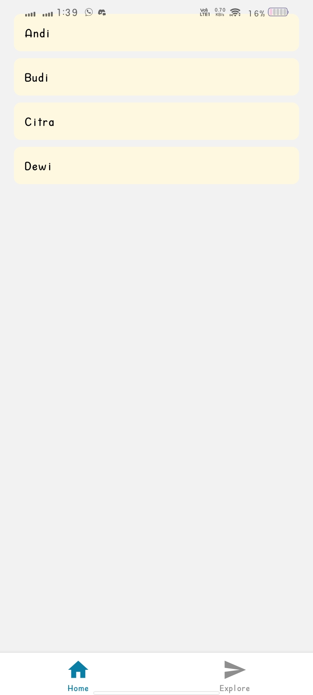
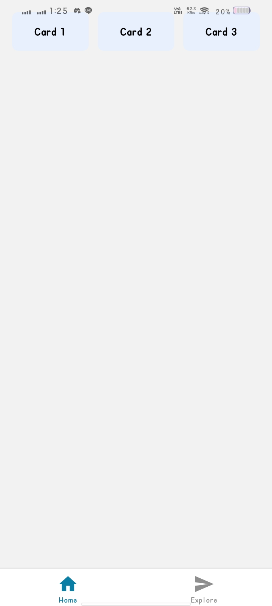

# Praktikum React Native – Pertemuan 1

## Cara Menjalankan

1. Pastikan sudah menginstal **Node.js**, **npm**, dan **Git**.
   Jalankan perintah berikut untuk memverifikasi:

   ```bash
   node -v
   npm -v
   git --version
   ```
2. Buat proyek baru dan jalankan aplikasi:

   ```bash
   npx create-expo-app rn-pertemuan1
   cd rn-pertemuan1
   npx expo start
   ```
3. Buka aplikasi di:

   * **Emulator Android** melalui Android Studio → AVD Manager, atau
   * **Aplikasi Expo Go** dengan memindai QR Code.
4. Jika berhasil, layar “**Welcome to Expo**” akan muncul.

---

## Versi yang Digunakan

| Komponen     | Versi      |
| ------------ | -------    |
| Node.js      | v22.200.0  |
| npm          | v10.9.3    |
| Expo CLI     | v54.0.13   |

---

## Perangkat Uji

* **Laptop:** Windows 10
* **Emulator:** Android Studio (Pixel 6 API 34)
* **Perangkat Fisik (Opsional):** Android 13 via Expo Go

---

## Screenshot

| Tahapan | Tampilan |
|----------|-----------|
| **1. Aplikasi Default (Welcome to Expo)** |  |
| **2. Counter – useState (Hitung Tombol Tambah)** |  |
| **3. FlatList – Daftar Data Mahasiswa / Diary** |  |
| **4. Layout Flexbox – Kartu Responsif** |  |


## 📚 Ringkasan Belajar

Pada praktikum ini, saya mempelajari langkah awal pengembangan aplikasi mobile menggunakan **React Native** dengan bantuan **Expo**. Proses dimulai dari verifikasi lingkungan kerja, pembuatan proyek baru, hingga menjalankan aplikasi di emulator atau perangkat fisik. Saya mengenal struktur dasar proyek seperti `App.js`, `package.json`, dan `app.json`, serta memahami bagaimana JSX digunakan untuk membangun tampilan.
Selain itu, saya berlatih membuat komponen interaktif dengan `useState`, mengatur tata letak menggunakan **Flexbox**, dan menampilkan daftar data menggunakan **FlatList**. Saya juga belajar konsep **props** untuk mengirim data antar komponen dan memahami peran **useEffect** dalam mengelola efek samping. Melalui praktikum ini, saya mendapatkan gambaran menyeluruh tentang dasar pembuatan UI dinamis dan reaktif di React Native, sekaligus memahami bagaimana perubahan kode dapat langsung terlihat lewat fitur **Fast Refresh**.
